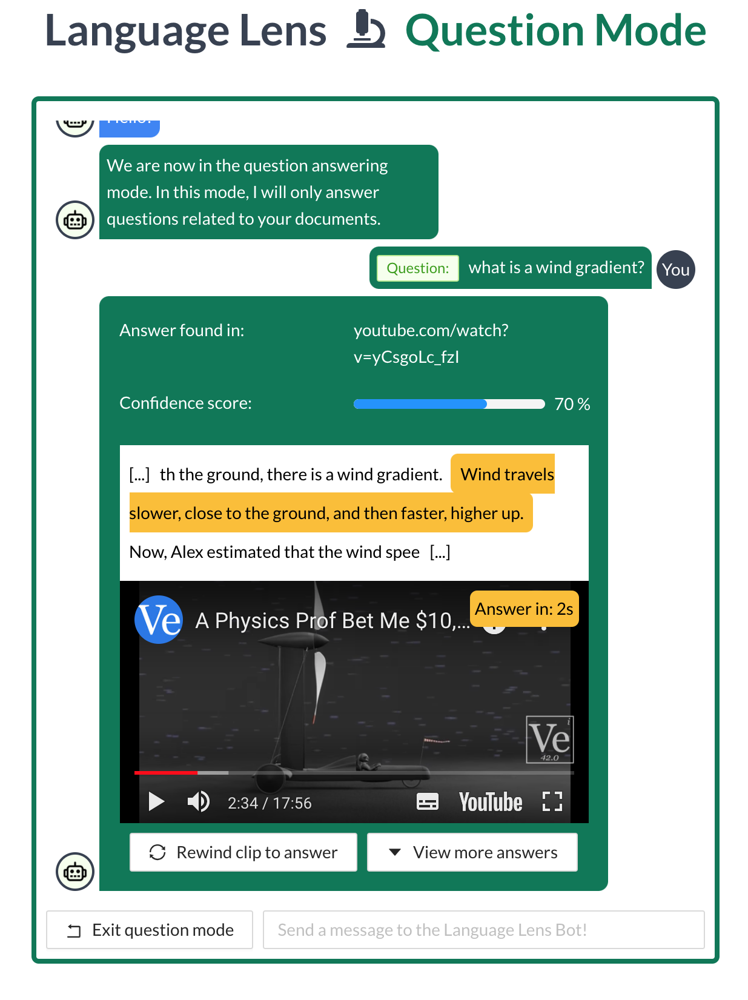
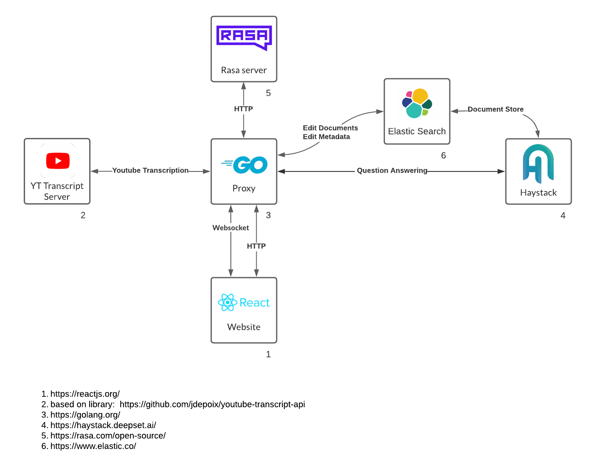

### What does it do?
Conversation based question answering for youtube, PDF & TXT documents.



### How?



### Start with docker-compose
1. ```docker-compose up```
2. Take a coffee break while it builds ☕
3. open ```http://localhost:8080```
